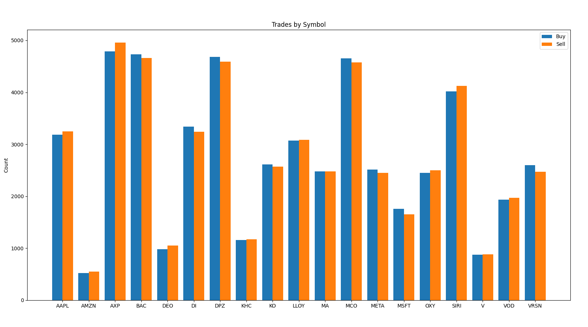

# KDB-X Quickstart Tutorial

This guide will get you up and running with KDB-X, ingesting data, querying it in SQL and KDB-X Python and performing analysis and persisting to a kdb database. 

## Install KDB-X and Environment Setup

To get your Community Edition of KDB-X, first register at [KX Developer Experience](https://developer.kx.com/products/kdb-x/install). At this stage, you can choose your OS, architecture and install type.
For this quickstart, we will assume defaults. For Linux/WSL installs, copy your license key which can be found on the top right of the page into the following command:
```bash
curl -sLO --oauth2-bearer your-license-key-here 
```

We will also install the KDB-X Python API and some pre-requisites:
```bash
pip install --upgrade pip 
pip install --upgrade --pre pykx 
python -c "import pykx as kx; kx.install_into_QHOME()" 
pip install matplotlib
git clone https://github.com/KxSystems/tutorials.git
```
## Start q and Load Data
Once the install has completed, you can start a q session by running:
```q
q -p 5050
```
This will start a q process on port 5050, which we will use later on to pull our data into a Python session. 

Load the Parquet module with the `use` keyword. For more on how modules are loaded see [here](https://code.kx.com/kdb-x/modules/module-framework/quickstart.html#search-path).
```q
q)([pq]):use`kx.pq;
```

Read in the parquet data we downloaded. This dataset contains is synthetic data representing trades and quotes   
```q
q)quote: pq `$"KDB-X/src/quotes.parquet";
q)trade: pq `$"tutorials/KDB-X/src/trades.parquet";
// convert the parquet tables into q objects  
q)quote:select from quote;  
q)trade:select from trade;
``` 

To get an overview of the data we just loaded we can run:
```q
q)select rows:count i from quote
```
```
rows 
------- 
2405225 
```
```q
q)meta quote
```
```q
c    | t f a 
-----| ----- 
date | p 
sym  | C 
time | p 
src  | C 
bid  | f 
ask  | f 
bsize| i 
asize| i 
```
And the same for the trade table:
```q
q)select rows:count i from trade 
```
```q
rows 
------ 
104575 
```
```q 
q)meta trade 
c    | t f a 
-----| ----- 
date | p 
sym  | C 
time | p 
src  | C 
price| f 
size | i 
``` 
There is a little data-cleaning to be done. It is better practice to have our "sym" column be of symbol type rather than stored as strings "C". This uses less memory and will be beneficial for space and query efficiency when we save it to disk later.
```q
q)trade:update `$sym, `$src from trade; 
q)quote:update `$sym, `$src from quote;
```

## Querying Data
The bid-ask spread is the difference between the highest price a buyer will pay (this bid) and the lowest price a seller will accept (the ask). Factors like market liquidity, volatility and trade volume influence how wide or narrow the spread is.  

Using the quote table, we can simply calculate the spread in q. 
```q
q)\ts spreadtab:select spread:((ask-bid)%ask)*100 from quote where ask>=bid, not null ask 
```
Using `\ts` in the code above also gives the time (in milliseconds) and memory space (in bytes) 
```q
92 201328304
```
```q
q)spreadtab
spread
----------
0.04946414
0.01650165
0.0330142
0.03300875
0.08252187
..
```

## Querying data in SQL 

Integration with SQL comes out of the box with KDB-X, supporting a wide range of common SQL features. Explore the [Reference page](https://code.kx.com/kdb-x/modules/sql/reference.html) for full operator and function details. 
```q
q).s.init[] 
q).s.e"SELECT COUNT(*) FROM quote"
```
```q
xcol 
------- 
2405225 
```
 
We can calculate the spread using SQL code using `s)` - another available syntax. 
```SQL
q)s)SELECT time, sym, ask, bid, asize, bsize, ((ask-bid)/ask)*100 AS spread from QUOTE where ask>=bid and ask IS NOT NULL
```
```q
time                          sym  ask   bid   asize bsize spread 
----------------------------------------------------------------------- 
2025.01.06D09:30:00.000000000 AAPL 60.65 60.62 10200 11400 0.04946414 
2025.01.06D09:30:00.000000000 AAPL 60.6  60.59 8400  2400  0.01650165 
2025.01.06D09:30:00.000000000 AAPL 60.58 60.56 3600  6000  0.0330142 
2025.01.06D09:30:01.000000000 AAPL 60.59 60.57 4800  3000  0.03300875 
2025.01.06D09:30:01.000000000 AAPL 60.59 60.54 9600  7200  0.08252187
..
```
 
## Timeseries Joins 

In finance it is common to join trade and quote tables in order to find the prevailing market quote (market bid/ask) at the time of the trade. Using q in KDB-X, this is simply one-line of code:   

```q
q)joined:aj[`sym`time;select time, sym, price, size from trade where date=2025.01.06;select time, sym, bid, ask from quote where date=2025.01.06] 
time                          sym  price size bid   ask   
----------------------------------------------------------
2025.01.06D09:30:00.000000000 AAPL 60.58 1479 60.56 60.58 
2025.01.06D09:30:09.000000000 AAPL 60.5  703  60.46 60.5  
2025.01.06D09:30:09.000000000 AAPL 60.5  5201 60.46 60.5  
2025.01.06D09:30:09.000000000 AAPL 60.46 1795 60.46 60.5  
2025.01.06D09:30:10.000000000 AAPL 60.5  2774 60.5  60.53
..
```

If your local machine is struggling to process all of the data, you could join a subset of the tables like this: 
```q
q)joined:aj[`sym`time;select time, sym, price, size from trade where date=2025.01.06, time within (09:30:00;10:30:00);select time, sym, bid, ask from quote where date=2025.01.06, time within (09:30:00;10:30:00)] 
```
Now that we have joined the data, we can see that for every row in the trade table, the prevailing bid and ask prices and therefore the count of the joined table matches the original trade table. 
```q
q)count joined
104575
```
 
Running `python` in another terminal window, we can do some analysis on our q table using [KDB-X Python](https://code.kx.com/kdb-x/get_started/kdb-x-python-install.html). 

We will start by importing some libraries including `pykx`:
```python
>>> import pandas as pd  
>>> import pykx as kx

Welcome to KDB-X Community Edition! For Community support, please visit https://kx.com/slack Tutorials can be found at https://github.com/KxSystems/tutorials Ready to go beyond the Community Edition? Email preview@kx.com 
```

We can open a connection to the q session we have running on port 5050:
```python
>>> conn = kx.SyncQConnection('localhost', 5050) 
```

Once we have our connection open, we can start using KDB-X Python to query the data:
```python
>>> qtable = conn['joined']
>>> qtable.select()  

pykx.Table(pykx.q(' time      sym  price size bid   ask 
--------------------------------------------------------- 
2025.01.06D09:30:00.000000000 AAPL 60.58 1479 60.56 60.58 
2025.01.06D09:30:09.000000000 AAPL 60.5  703  60.46 60.5 
2025.01.06D09:30:09.000000000 AAPL 60.5  5201 60.46 60.5 
2025.01.06D09:30:09.000000000 AAPL 60.46 1795 60.46 60.5 
2025.01.06D09:30:10.000000000 AAPL 60.5  2774 60.5  60.53 
2025.01.06D09:30:19.000000000 AAPL 60.35 824  60.35 60.4 
2025.01.06D09:30:22.000000000 AAPL 60.34 1809 60.34 60.35 
2025.01.06D09:30:25.000000000 AAPL 60.33 5626 60.33 60.35 
2025.01.06D09:30:29.000000000 AAPL 60.33 8478 60.32 60.33 
2025.01.06D09:30:34.000000000 AAPL 60.29 286  60.28 60.29 
2025.01.06D09:30:38.000000000 AAPL 60.39 1041 60.36 60.39 
2025.01.06D09:30:44.000000000 AAPL 60.4  3023 60.36 60.4 
2025.01.06D09:30:49.000000000 AAPL 60.27 4404 60.27 60.28 
2025.01.06D09:30:51.000000000 AAPL 60.28 1203 60.28 60.31 
2025.01.06D09:31:00.000000000 AAPL 60.19 2922 60.15 60.19 
2025.01.06D09:31:01.000000000 AAPL 60.1  3557 60.1  60.15 
2025.01.06D09:31:01.000000000 AAPL 60.1  6290 60.1  60.15 
2025.01.06D09:31:08.000000000 AAPL 60.01 1775 59.99 60.01 
2025.01.06D09:31:08.000000000 AAPL 60.01 1663 59.99 60.01 
2025.01.06D09:31:11.000000000 AAPL 59.96 62   59.93 59.96 
.. 
')) 
``` 
Now that we know what the prevailing quote was for each trade, we can work out which direction the trade was in i.e., was it a Buy or Sell?
We can then aggregate the trades by symbol to find out the number of trades per symbol were a Buy or a Sell.
```python
>>> sides = conn('0!select count i by side,sym from joined:update side:?[price=bid;`B;`S] from joined').pd() 
>>> print(sides) 
   side   sym     x 
0     B  AAPL  3184 
1     B  AMZN   519 
2     B   AXP  4790 
3     B   BAC  4729 
4     B   DEO   980 
5     B    DI  3342 
6     B   DPZ  4681 
7     B   KHC  1154 
8     B    KO  2611 
9     B  LLOY  3070 
10    B    MA  2477 
11    B   MCO  4656 
12    B  META  2515 
13    B  MSFT  1755 
14    B   OXY  2448 
15    B  SIRI  4016 
16    B     V   877 
17    B   VOD  1937 
18    B  VRSN  2600 
19    S  AAPL  3245 
20    S  AMZN   547 
21    S   AXP  4958 
22    S   BAC  4664 
23    S   DEO  1050 
24    S    DI  3239 
25    S   DPZ  4593
26    S   KHC  1169 
27    S    KO  2567 
28    S  LLOY  3087 
29    S    MA  2481 
30    S   MCO  4576 
31    S  META  2453 
32    S  MSFT  1651 
33    S   OXY  2499 
34    S  SIRI  4127 
35    S     V   883 
36    S   VOD  1971 
37    S  VRSN  2474 
```
 
## Visualization

Using q through KDB-X Python, we can manipulate the data into a table that we can then plot through Python Library Matplotlib. 
```python
>>> plottable = conn('0!(select buy:count i by sym from joined where side=`B) lj (select sell:count i by sym from joined where side=`S)').pd()
>>> print(plottable)
     sym   buy  sell
0   AAPL  3184  3245
1   AMZN   519   547
2    AXP  4790  4958
3    BAC  4729  4664
4    DEO   980  1050
5     DI  3342  3239
6    DPZ  4681  4593
7    KHC  1154  1169
8     KO  2611  2567
9   LLOY  3070  3087
10    MA  2477  2481
11   MCO  4656  4576
12  META  2515  2453
13  MSFT  1755  1651
14   OXY  2448  2499
15  SIRI  4016  4127
16     V   877   883
17   VOD  1937  1971
18  VRSN  2600  2474
```

The format of plottable now lends itself to be easily plotted in a bargraph comparing numbers of trades (Buy/Sell) per symbol.
```python
>>> import numpy as np 
>>> import matplotlib.pyplot as plt 
>>> symcols = plottable['sym']  
>>> y1, y2 = plottable['buy'], plottable['sell'] 
>>> w, x = 0.4, np.arange(len(symcols)) 
>>> fig, ax = plt.subplots()
>>> ax.bar(x - w/2, y1, width=w, label='Buy')
>>> ax.bar(x + w/2, y2, width=w, label='Sell')  
>>> ax.set_xticks(x) 
>>> ax.set_xticklabels(symcols) 
>>> ax.set_ylabel('Count') 
>>> ax.set_title('Trades by Symbol') 
>>> ax.legend() 
>>> plt.show()
```



## Persisting data into a kdb HDB 

Now we know how to enrich the data to determine which direction the trade was in (Buy or Sell), we can persist this data in a kdb database.
Back in our q process, we can use the joined table to give a fuller picture than the original trade table. 
```q
q)joined
time                          sym  price size bid   ask   side
--------------------------------------------------------------
2025.01.06D09:30:00.000000000 AAPL 60.58 1479 60.56 60.58 S
2025.01.06D09:30:09.000000000 AAPL 60.5  703  60.46 60.5  S
2025.01.06D09:30:09.000000000 AAPL 60.5  5201 60.46 60.5  S
2025.01.06D09:30:09.000000000 AAPL 60.46 1795 60.46 60.5  B
2025.01.06D09:30:10.000000000 AAPL 60.5  2774 60.5  60.53 B
..
```

In kdb+ databases, financial data is commonly partitioned by date. Even though we only have 1 day's worth of data in memory, it is still good practice to structure your data like this so that future dates can be added easily. 

```q
q)dt:exec distinct `date$time from joined;
```
Now we define where we want the data to be stored, and create a function `saveDB` that will iterate through the dates in the table and save them using .Q.dpft which will also rearrange the columns and apply the `p#`attribute to the specified column - in this case `sym`.
```q
q)path:hsym `$"~/data";
q)saveDB:{[tab;dt] trade::select time, sym, price, size, side from tab where time.date = dt; .Q.dpft[path;dt;`sym;`trade]}; 
q)saveDB[joined;] each dt 
`trade
```

It is good pratice to then load or reload the HDB where you have saved the data, and this will confirm the data has been saved down appropriately. 
```q
q)\l ~/data 
q)trade 
date       sym  time                          price size side 
------------------------------------------------------------- 
2025.01.06 AAPL 2025.01.06D09:30:00.000000000 60.58 1479 S 
2025.01.06 AAPL 2025.01.06D09:30:09.000000000 60.5  703  S 
2025.01.06 AAPL 2025.01.06D09:30:09.000000000 60.5  5201 S 
2025.01.06 AAPL 2025.01.06D09:30:09.000000000 60.46 1795 B 
2025.01.06 AAPL 2025.01.06D09:30:10.000000000 60.5  2774 B 
2025.01.06 AAPL 2025.01.06D09:30:19.000000000 60.35 824  B 
```

And finally, we can check the parted attribute (p#) has been set correctly.
```q
q)meta trade 
c    | t f a 
-----| ----- 
date | d 
sym  | s   p 
time | p 
price| f 
size | i 
side | s 
```

# Conclusion
Congratulations! You have completed the KDB-X Quickstart tutorial.

In this guide, you learned how to:
- Load the Parquet module using the Module Framework.
- Clean data using q.
- Enrich financial data using q concepts e.g. an asof join.
- Switch between q, SQL and KDB-X Python to analyze data.
- Visualize q data using KDB-X Python and Matplotlib.
- Persist data to a historical database using kdb+ best practices.

Ready for more? Get hands-on with the q language in [A Brief Introduction to q and KDB-X](https://code.kx.com/kdb-x/learn/brief-introduction.html) or try out the other tutorials on [GitHub](https://github.com/KxSystems/tutorials). 
